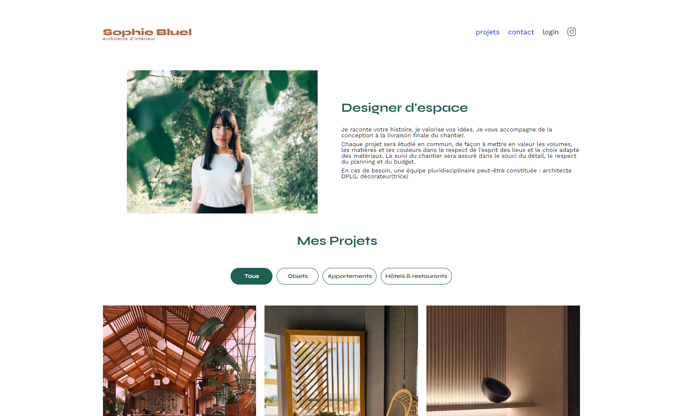

# P2-Sophie-Bluel

## Projet n°2 - Développeur Applications JavaScript

## Contexte

Vous travaillez comme développeur front-end pour l’agence ArchiWebos, qui comprend 50 salariés. Ayant terminé votre dernier projet avec un peu d'avance, vous êtes envoyé en renfort comme développeur front-end d’une équipe qui travaille sur la conception du site portfolio d’une architecte d’intérieur, Sophie Bluel. Ce projet fait partie du parcours développeur front-end chez OpenClassrooms.

## Objectif

L'objectif de ce projet est de créer une page web dynamique en utilisant JavaScript. Vous devez développer les fonctionnalités suivantes :
- La page de présentation des travaux de l'architecte
- La page de connexion de l'administrateur du site
- La modale permettant d'uploader de nouveaux médias

## Cahier des charges

- **Create React App** : Initialiser le projet avec une base solide
- **React Router** : Gérer les différentes routes de l'application
- **Styling** : Utilisation de CSS et optionnellement de Sass
- **Pas de librairie React externe** : Pas de bibliothèques externes pour assurer la légèreté et la performance de l'application

## Compétences évaluées

- Créer une page web dynamique avec JavaScript
- Récupérer les données utilisateurs via des formulaires en JavaScript
- Manipuler les éléments du DOM avec JavaScript
- Gérer les événements utilisateurs avec JavaScript

## Technologies Utilisées

  

- Utilisation de `Figma` pour la conception des maquettes.
- Utilisation de `JavaScript` pour le développement dynamique de la page.
- Utilisation de `Sass` et `CSS` pour le style.
- Utilisation de `GitHub` pour le versionnement du code.

## Installation

### Prérequis

Assurez-vous d'avoir [Node.js](https://nodejs.org/) et [npm](https://www.npmjs.com/) installés sur votre machine.

### Installation du Backend

1. Cloner le dépôt en local.
2. Se placer dans le dossier `Backend`.
3. Pour lancer l'API, exécutez la commande : `npm start`.

### Scripts Disponibles

Dans le répertoire du projet, vous pouvez exécuter les commandes suivantes :

#### `npm start`

Lance l'application en mode développement.\
Ouvrez [http://localhost:3000](http://localhost:3000) pour voir l'application dans votre navigateur.

La page se rechargera automatiquement lors de modifications.\
Vous pouvez également voir les éventuelles erreurs de lint dans la console.

## Compte admin de test

- **Email** : sophie.bluel@test.tld
- **Mot de passe** : S0phie 

## Info

Une sauvegarde du backend est accessible depuis le dépôt. Si vous souhaitez utiliser celle-ci, n'oubliez pas d'initialiser les dépendances avec `npm install`.

### Conclusion

En suivant ce guide, vous pourrez configurer et lancer rapidement le projet de Sophie Bluel. Le respect des meilleures pratiques de développement et l'utilisation des outils et technologies appropriés garantiront le succès de ce projet ambitieux. Bonne programmation !
